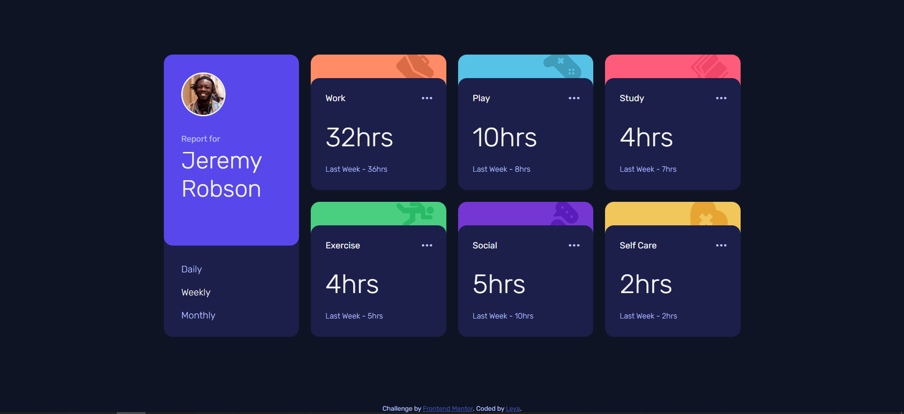
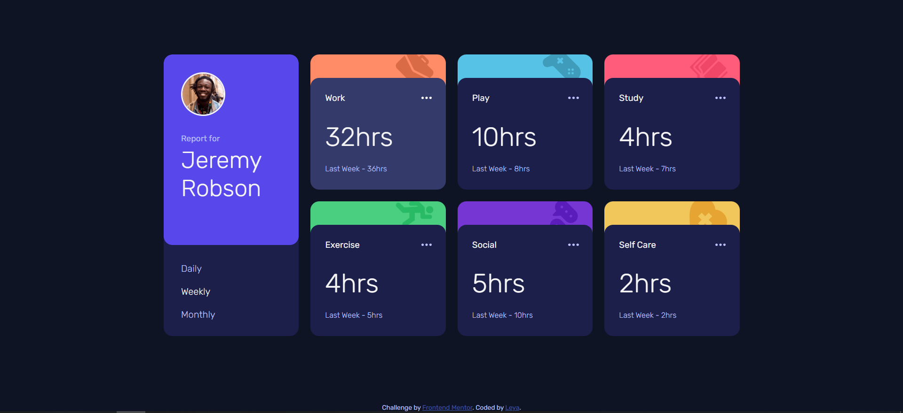
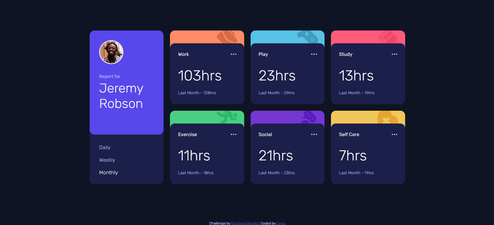
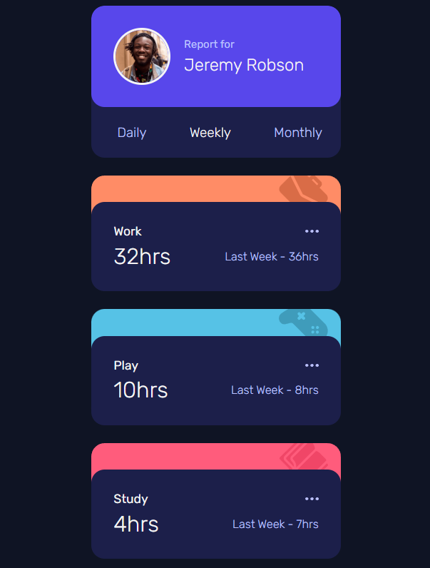
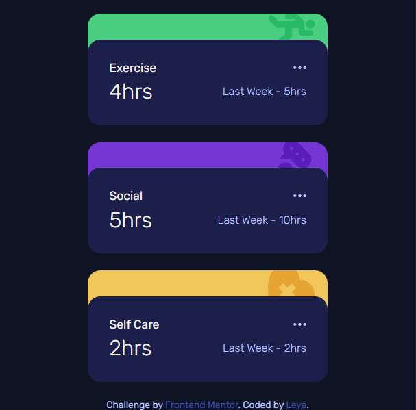

# Frontend Mentor - Time tracking dashboard solution

This is a solution to the [Time tracking dashboard challenge on Frontend Mentor](https://www.frontendmentor.io/challenges/time-tracking-dashboard-UIQ7167Jw).

## Table of contents

- [Overview](#overview)
  - [The challenge](#the-challenge)
  - [Screenshot](#screenshot)
  - [Links](#links)
- [My process](#my-process)
  - [Built with](#built-with)
  - [What I learned](#what-i-learned)
  - [Continued development](#continued-development)
- [Author](#author)


## Overview

### The challenge

Users should be able to:

- View the optimal layout for the site depending on their device's screen size
- See hover states for all interactive elements on the page
- Switch between viewing Daily, Weekly, and Monthly stats

Expected behaviour:

- The text for the previous period's time should change based on the active timeframe. For Daily, it should read "Yesterday" e.g "Yesterday - 2hrs". For Weekly, it should read "Last Week" e.g. "Last Week - 32hrs". For monthly, it should read "Last Month" e.g. "Last Month - 19hrs".

### Screenshot

Desktop version  


Desktop version active state  
  

Desktop version Monthly  


Mobile version  



### Links

- Solution URL: [solution](https://www.frontendmentor.io/solutions/time-tracking-dashboard-using-flexbox-and-grid-PPOhZdqDb3)
- Live Site URL: [live site](https://minleya.github.io/time-tracking-dashboard/)

## My process

### Built with

- Semantic HTML5 markup
- CSS custom properties
- Flexbox
- CSS Grid
- Mobile-first workflow

### What I learned

I used promises and json in practice.

```js
fetch("assets/data/data.json")
  .then((response) => response.json())
  .then((data) => {
    console.log("data is loaded");

    let currentPeriod = "weekly";
    updateDashboard(data, currentPeriod);

    const buttons = document.querySelectorAll(".period-toggle-button");

    document.querySelector(".period-toggle-button.weekly").classList.add("active");

    buttons.forEach((button) => {
      button.addEventListener("click", () => {
        if (button.classList.contains("daily")) currentPeriod = "daily";
        if (button.classList.contains("weekly")) currentPeriod = "weekly";
        if (button.classList.contains("monthly")) currentPeriod = "monthly";

        buttons.forEach(b => b.classList.remove("active"));
        button.classList.add("active");

        updateDashboard(data, currentPeriod);
      });
    });
  })
  .catch((err) => {
    console.error("json download error: " + err);
  });
```


### Continued development

I want to continue using grid and js in future projects.

## Author

- GitHub - [minLeya](https://github.com/minLeya)
- Frontend Mentor - [@minLeya](https://www.frontendmentor.io/profile/minLeya)